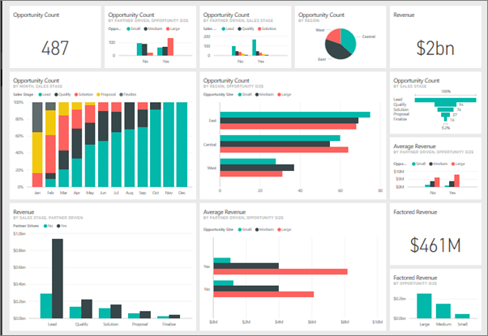
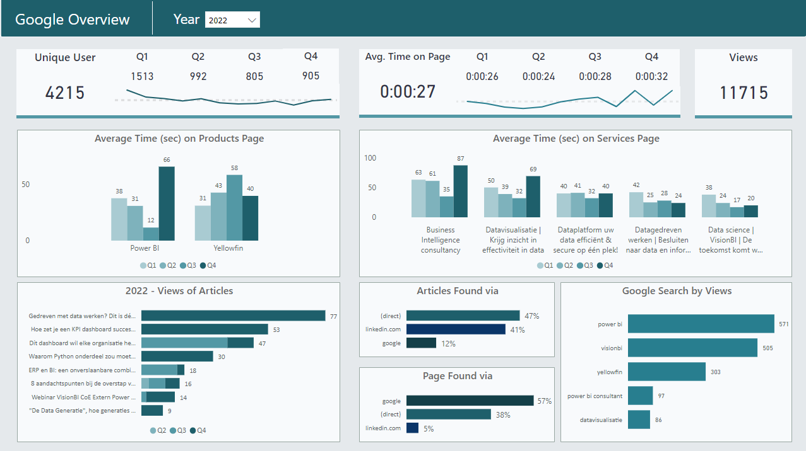

# Project name
## heading 2
### heading 3
#### heading 4
##### heading 5

There are 5 heading .

# Project name
Py project is focus on ....
### Setup / installation

`npm install`

`pip install`

`composoer install`

### Todo list

- [ ] Home page

- [ ] About page

- [X] Service page

### Screenshot

### Link

CSS Framwork [Tailwindcss](https://tailwindcss.com/)

CSS Framwork [W3school](https://www.w3schools.com/html/)

### List
Unorder list

- One

- Two

    - Other sub list

Order list

1. One

2. Two

3. Three